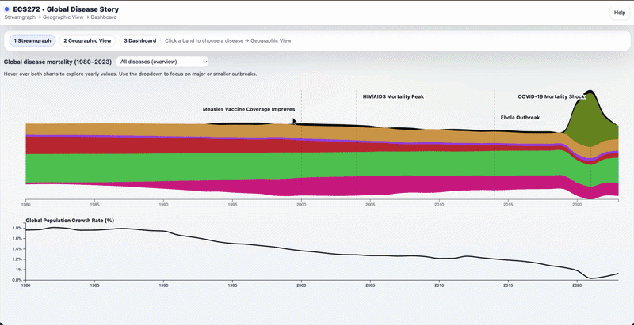

# ECS272 • Global Disease Story

An interactive data visualization exploring the demographic impact of major infectious disease outbreaks from 1980 to 2023. This project was built for ECS 272: Information Visualization at UC Davis.

## Team

Ajinkya Abhay Gothankar, Manami Nakagawa, Jeanine Ohene-Agyei
ECS 272 — UC Davis

## Overview

This visualization follows a drill-down storytelling structure across three connected views:

- **Stream Graph** — Explore global disease mortality trends over time across seven diseases, with a synchronized population growth rate chart beneath
- **Interactive Globe** — Examine the geographic distribution of disease burden across countries, with time scrubbing and autoplay
- **Country Dashboard** — Drill into a specific country to compare disease burden against demographic indicators including life expectancy, population growth rate, and GNI per person

The seven diseases covered are: HIV/AIDS, Malaria, Measles, Dengue, Influenza, Ebola, and COVID-19.

## Demo



## Getting Started

### Prerequisites

- Node.js installed on your machine
- A free Mapbox account (required for the globe view)

### 🚀 Important Steps Before Running

Before starting the project locally, please complete the following setup:

#### 1. Create a Mapbox Account
Sign up at: https://www.mapbox.com/

#### 2. Copy Your Public Access Token
After logging in:
- Go to your Mapbox dashboard
- Copy your **Public Access Token**

#### 3. Create a `.env` File
In the root directory of this project (same level as `package.json`), create a file named:
```
.env
```

#### 4. Add Your Mapbox Token
Inside the `.env` file, add:
```
VITE_MAPBOX_TOKEN=YOUR_PUBLIC_ACCESS_TOKEN
```
Replace `YOUR_PUBLIC_ACCESS_TOKEN` with your actual Mapbox public key.

> ⚠️ Do not include quotes or a semicolon.

#### 5. Install Dependencies
```bash
npm install
```

#### 6. Run the Development Server
```bash
npm run dev
```

Then open your browser and navigate to the local URL shown in your terminal (typically `http://localhost:5173`).

## How to Use

1. **Stream Graph** — Hover over the chart to explore yearly disease mortality values. Use the dropdown to switch between the overview, high-volume diseases, and low-volume diseases. Click any disease band to navigate to the globe filtered to that disease.
2. **Globe** — Drag to rotate, hover over countries to see values, and use the year slider or autoplay to explore changes over time. Click a country to open its country dashboard.
3. **Dashboard** — Compare disease burden against life expectancy, population growth rate, and population trends for the selected country. Hover over any chart to sync the year indicator across all views.
